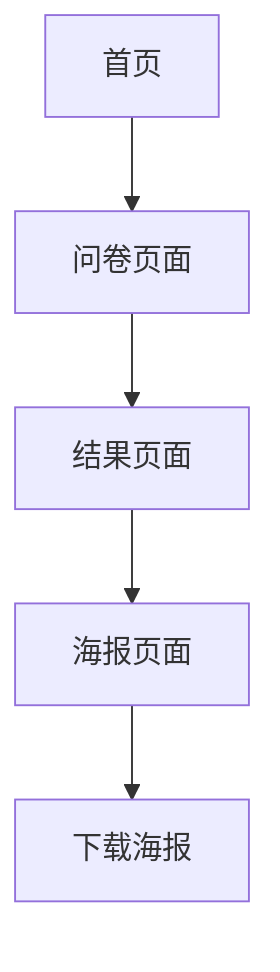

# 幸福感计算器产品需求文档

## 1. 产品概述

一个移动端H5幸福感计算器网站，通过客观量化指标评估用户的幸福指数，默认英文界面，支持多语言切换。
基于经济实力、社会地位、健康状况等具体数据计算幸福感得分，用户可生成个性化报告和精美海报下载分享。

## 2. 核心功能

### 2.1 用户角色

本产品无需用户注册登录，所有用户均可直接使用全部功能。

### 2.2 功能模块

我们的幸福感计算器包含以下主要页面：

1. **首页**：产品介绍、语言切换、开始测试按钮
2. **问卷页面**：多维度评估表单、国家选择、进度指示
3. **结果页面**：幸福感得分展示、详细分析报告
4. **海报页面**：个性化结果海报、下载分享功能

### 2.3 页面详情

| 页面名称 | 模块名称   | 功能描述                            |
| ---- | ------ | ------------------------------- |
| 首页   | 产品介绍区  | 展示幸福感计算器的核心价值和使用说明              |
| 首页   | 语言切换   | 支持中文和英文界面切换，默认英文                |
| 首页   | 开始测试按钮 | 引导用户进入问卷评估流程                    |
| 问卷页面 | 国家选择   | 选择所在国家，默认美国，影响收入购买力系数           |
| 问卷页面 | 客观指标表单 | 包含经济实力、社会地位、健康状况、资产状况等客观量化指标的填写 |
| 问卷页面 | 进度指示器  | 显示当前答题进度和剩余题目数量                 |
| 结果页面 | 得分展示   | 显示0-100分的幸福感总分和各维度得分            |
| 结果页面 | 分析报告   | 基于得分提供个性化的幸福感分析和建议              |
| 结果页面 | 生成海报按钮 | 跳转到海报页面生成分享图片                   |
| 海报页面 | 海报设计   | 精美的个性化结果海报，包含得分、分析和装饰元素         |
| 海报页面 | 下载功能   | 使用HTML2Canvas技术截图并下载海报          |

## 3. 核心流程

用户访问首页 → 选择语言 → 点击开始测试 → 选择国家 → 填写多维度问卷 → 查看幸福感得分和分析 → 生成个性化海报 → 下载分享



## 4. 用户界面设计

### 4.1 设计风格

* 主色调：温暖的橙色 #FF6B35 和舒缓的蓝色 #4ECDC4

* 辅助色：柔和的粉色 #FFE66D 和深灰色 #2C3E50

* 按钮样式：圆角矩形，带有轻微阴影和渐变效果

* 字体：中文使用苹方/思源黑体，英文使用Roboto，主要字号16px-24px

* 布局风格：卡片式设计，顶部导航，移动端优先的响应式布局

* 图标风格：线性图标配合彩色填充，温馨友好的视觉风格

### 4.2 页面设计概览

| 页面名称 | 模块名称   | UI元素              |
| ---- | ------ | ----------------- |
| 首页   | 产品介绍区  | 大标题、副标题、插画图片、渐变背景 |
| 首页   | 语言切换   | 右上角切换按钮，中英文标识     |
| 首页   | 开始测试按钮 | 大号圆角按钮，渐变色背景，居中放置 |
| 问卷页面 | 国家选择   | 下拉选择框，国旗图标，默认选中中国 |
| 问卷页面 | 多维度表单  | 卡片式问题布局，单选按钮，滑动切换 |
| 问卷页面 | 进度指示器  | 顶部进度条，百分比显示，动画效果  |
| 结果页面 | 得分展示   | 大号数字显示，圆形进度图，彩色渐变 |
| 结果页面 | 分析报告   | 文字卡片，图表展示，分维度得分   |
| 海报页面 | 海报设计   | 垂直布局，装饰元素，个人信息展示  |
| 海报页面 | 下载功能   | 底部固定按钮，下载图标，点击反馈  |

### 4.3 响应式设计

移动端优先设计，PC端定宽居中显示（最大宽度480px），支持触摸交互优化。

## 5. 问卷设计详情

### 5.1 评估维度和权重

基于客观量化指标的幸福感评估包含以下6个核心维度：

| 维度         | 权重  | 说明                   |
| ---------- | --- | -------------------- |
| 经济实力       | 35% | 收入、存款、资产等客观财务数据      |
| 社会地位       | 20% | 职位层级、教育背景等社会身份       |
| 健康状况       | 15% | 疾病数量、体检指标等健康数据       |
| 资产状况       | 15% | 房产、车辆等固定资产           |
| 家庭状况       | 5%  | 婚姻状态、子女数量等家庭结构       |
| 个人习惯与心理满足度 | 10% | 旅游频次、娱乐方式、子女成绩、兴趣爱好等 |

### 5.2 具体问题设计

#### 5.2.1 经济实力维度（40%权重）

**问题1：您的年收入是多少？（美元）**

* A. $0 - $30,000 (1分)

* B. $30,001 - $60,000 (2分)

* C. $60,001 - $100,000 (3分)

* D. $100,001 - $200,000 (4分)

* E. $200,000以上 (5分)

**问题2：您的存款金额是多少？（美元）**

* A. $0 - $10,000 (1分)

* B. $10,001 - $50,000 (2分)

* C. $50,001 - $100,000 (3分)

* D. $100,001 - $500,000 (4分)

* E. $500,000以上 (5分)

**问题3：您的投资资产总值是多少？（美元）**

* A. $0 (1分)

* B. $1 - $50,000 (2分)

* C. $50,001 - $200,000 (3分)

* D. $200,001 - $1,000,000 (4分)

* E. $1,000,000以上 (5分)

#### 5.2.2 社会地位维度（25%权重）

**问题4：您的职位层级是？**

* A. 无业/学生 (1分)

* B. 普通员工/基层员工 (2分)

* C. 主管/团队负责人 (3分)

* D. 高管/部门总监 (4分)

* E. 老板/CEO/创始人 (5分)

**问题5：您的最高学历是？**

* A. 高中及以下 (1分)

* B. 大专/职业学校 (2分)

* C. 本科学士学位 (3分)

* D. 硕士学位 (4分)

* E. 博士学位 (5分)

#### 5.2.3 健康状况维度（20%权重）

**问题6：您目前有多少种已确诊的慢性疾病？**

* A. 5种以上 (1分)

* B. 3-4种 (2分)

* C. 1-2种 (3分)

* D. 0种，但有健康隐患 (4分)

* E. 0种，身体健康 (5分)

**问题7：您的BMI指数是多少？**

* A. <18.5 或 >30 (1分)

* B. 18.5-20 或 27-30 (2分)

* C. 20-22 或 25-27 (3分)

* D. 22-24 或 24-25 (4分)

* E. 22-24 (标准范围) (5分)

#### 5.2.4 资产状况维度（10%权重）

**问题8：您拥有多少套房产？**

* A. 0套（租房） (1分)

* B. 1套（自住） (2分)

* C. 2套 (3分)

* D. 3-5套 (4分)

* E. 5套以上 (5分)

**问题9：您拥有的车辆价值总计多少？（美元）**

* A. $0（无车） (1分)

* B. $1 - $20,000 (2分)

* C. $20,001 - $50,000 (3分)

* D. $50,001 - $100,000 (4分)

* E. $100,000以上 (5分)

#### 5.2.5 家庭状况维度（5%权重）

**问题10：您的婚姻状况是？**

* A. 离异/丧偶 (1分)

* B. 单身 (2分)

* C. 恋爱中 (3分)

* D. 已婚无子女 (4分)

* E. 已婚有子女 (5分)

#### 5.2.6 个人习惯与心理满足度维度（10%权重）

**问题11：您每年出去旅游多少次？**

* A. 0次 (1分)

* B. 1-2次 (3分)

* C. 3-4次 (4分)

* D. 5-6次 (5分)

* E. 7次以上 (5分)

**问题12：您常见的娱乐方式有哪些？（多选题，每选一项+0.5分，最高3分）**

* A. 看电影/电视剧

* B. 运动健身

* C. 阅读书籍

* D. 玩游戏

* E. 听音乐

* F. 社交聚会

* G. 购物

* H. 烹饪

* I. 摄影

* J. 其他兴趣爱好

**问题13：如果您有孩子，您对他们的学业表现感到？**

* A. 非常骄傲 (5分)

* B. 比较满意 (4分)

* C. 一般般 (3分)

* D. 有些担心 (2分)

* E. 很不满意 (1分)

* F. 没有孩子 (3分)

**问题14：您每周花多少时间在个人兴趣爱好上？**

* A. 0-2小时 (1分)

* B. 3-5小时 (2分)

* C. 6-10小时 (3分)

* D. 11-15小时 (4分)

* E. 16小时以上 (5分)

### 5.3 国家购买力系数

不同国家的购买力差异会影响经济实力维度的评分：

| 国家 | 系数   | 说明     |
| -- | ---- | ------ |
| 美国 | 1.0  | 基准系数   |
| 瑞士 | 0.6  | 生活成本极高 |
| 日本 | 0.8  | 生活成本很高 |
| 德国 | 0.85 | 生活成本较高 |
| 中国 | 1.3  | 生活成本较低 |
| 印度 | 2.0  | 生活成本很低 |
| 泰国 | 1.8  | 生活成本较低 |

### 5.4 评分计算规则

**总分计算公式：**

```
经济实力得分 = (问题1得分 + 问题2得分 + 问题3得分) / 3 × 购买力系数
社会地位得分 = (问题4得分 + 问题5得分) / 2
健康状况得分 = (问题6得分 + 问题7得分) / 2
资产状况得分 = (问题8得分 + 问题9得分) / 2
家庭状况得分 = 问题10得分
个人习惯与心理满足度得分 = (问题11得分 + 问题12得分 + 问题13得分 + 问题14得分) / 4

总分 = (经济实力得分 × 35% + 社会地位得分 × 20% + 健康状况得分 × 15% + 资产状况得分 × 15% + 家庭状况得分 × 5% + 个人习惯与心理满足度得分 × 10%) × 20
```

**幸福感等级划分：**

* 90-100分：人生赢家

* 80-89分：成功人士

* 70-79分：中产阶级

* 60-69分：普通民众

* 60分以下：需要努力

